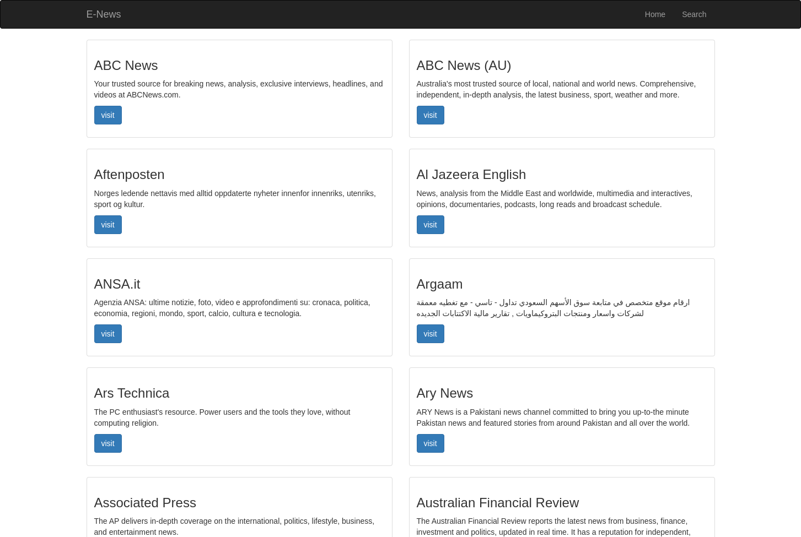
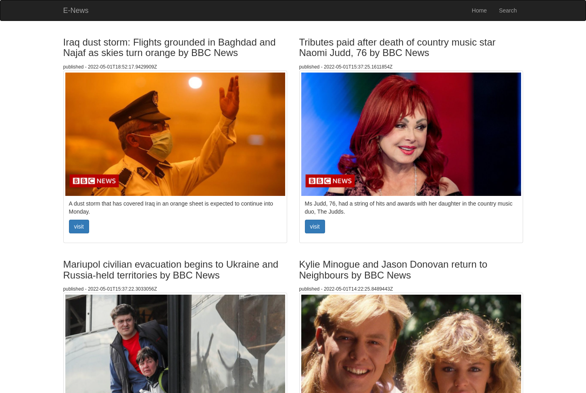

# Flask-News-Webapp


### By: Edwin Karimi

## Table of Content

- [Description](#description)
- [Installation Requirement](#usage)
- [Technology Used](#technologies)
- [Licence](#licence)
- [Authors Info](#author-info)

## Description

<br>
<br>
This is a news website made with Flask and the [News API](https://newsapi.org/). The webapp solely relies on the News API for data and only offers a few headlines with links to the original source of the news. On loading, the user is shown a list of news sources from which they can choose from. After selecting a source, thery are redirected to a page with top healines from that source. If the user wants more info, they can click on the visit button to read more on the article on the sources website. As for the UI, it is made possible with the flask-bootstrap extension which integrates bootstrap 3 into flask apps offering a more responsive design.
<br>
<br>


## Behaviour Driven Development

The user is able to;

- Get a list of news sources

- Can pick a source and see top headlines

- Search for news using a keyword

### Requirements

- Either a computer, phone, tablet or an Ipad

- Access to the Internet

### 1. Local Repository

- Make sure you have a stable internet to have the ability to clone the repository.
- Type the following command in your terminal to clone this repository

```
git clone https://github.com/Edu58/Flask-News-Webapp.git
```

If you are using SSH, use the following command

```
git clone git@github.com:Edu58/Flask-News-Webapp.git
```

When you run the commands successfully, you should have a local version of this repository.

### Usage
To run the app, unzip the cloned folder if it is zipped. Navigate inside the folder and run ```python manage.py runserver``` or ```python manage.py server```. Any of these 2 should start the server at localhost:5000. Once the server is runnning, open your browser and enter localhost:5000 in your url bar of your preferred browser, and you should be able to use the app now. This will only work on the computer running the server. It is not available to anyone else. If you want to show the app to anyone else, you can share the live link --> [flask-enews.herokuapp.com/](https://flask-enews.herokuapp.com/).

### 2. Online Repository

- Make sure you have a stable internet for forking this repository.
- According to the license, you can fork this project. You need to click on the forking icon and it will be added as one of your repositories

Feel free to fork the project and have fun with it. Happy coding!

## Technologies

- Flask
- Flask-Bootstrap
- Flask-Script

## Licence

Copyright (c) Edwin Karimi 2022 - [MIT Licence](LICENSE)

## Author Info

- Twitter - [@GISDevEd](https://twitter.com/GISDevEd)
- Linkedin - [edwin-karimi](https://www.linkedin.com/in/edwin-karimi/)
